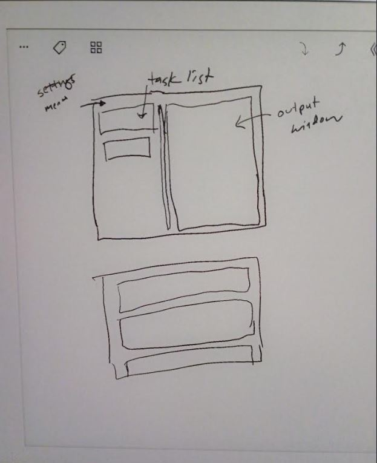

### 04/14/2026

10:32 PM

Man... I really like this laptop's keyboard the ASUS 1000HA. I ordered another battery... for it. Since the current battery only goes up to around 10% capacity. I actually bought one already and it was bad... waste of $30.

It turns out the ASUS 901 uses the same battery so that's what I got, $20 maybe it's also dead... idk, it's funny even if these laptops end up just sitting somewhere unused, I can't let go of the battery not working.

But yeah... for the AUS 900 I've been trying to build the python wheel temporalio and it's failed a few times now running overnight...

So I figure it's time I just commit to using C++ and GTK. I use C++ for my robotics/hardware projects so would be good to get better at it.

Won't get much done today just wanted to do something... I setup git on this computer (typing on it now the 1000HA) and got Kate setup...

Pretty beat at this point and just dealt with my taxes... damn I'm down another 3 grand brutal... which I actually can't pay that so I'll be doing payments. Funny even with six figs I'm check to check.

---

### 04/09/2026

10:01 PM

Currently trying to get this running on an ASUS Eee PC 900 which has an Intel Celeron M 900MHz

Problem with rustup and the i686/i386 target

---

### 03/27/2026

7:09 PM

Alright time to fix some bugs

When you add another agent it adds the same one...

7:14 PM

Yeah so when I click the first agent in the list, it clicks the last one

Some kind of reference error

7:32 PM

I am a little distracted Friday but I did fix the wrong agent opening

One glaring error is the event blocking nature of the button click/calling a command

The button depress animation freezes like wth...

I was thinking threading you need a loop... but I guess it could just fire and die off the thread whenever execution is done

7:38 PM

Oh I know what else to add... I need to open the modal so the agent can be modified like the prompt or add tools.

Another future which I don't have is storing agent conversation so the history can be fed back into the agent as context

But I'm not doing that today

Delete agent should remove it from right side took

7:42 PM

Damn I wasn't putting in the prompts this whole time

8:17 PM

Debugging a problem right now where you delete an agent on left sidebar and it throws off the button indexes, tries to start deleted agent

8:42 PM

It's that red skull thing "fix one bug, two more shall rise and take its place"

This one is you are running two agents, you delete one, it tries to delete all

- 2 agents
- start both
- delete first
- deletes both

9:05 PM

Okay the delete, re-render issue is addressed

I'm calling it here, got something usable

---

### 03/26/2026

6:14 PM

Alright this is it, no excuse now

Can run agents

6:27 PM

I'm not sure what the delay is when you first start the call. Hopefully once the agent is running it's not so bad.

6:37 PM

It's funny, I can make this but I don't know what to use it for

Need to look at my notes

6:41 PM

It's interesting even if I don't use the agent stuff right away just importing it makes the startup take longer

So right now I setup a basic function that returns the model API key based on requested model. Also an Agent class that instantiates an agent instance based on provided parameters... basic tools like weather and crypto (lol).

I need to make it work end to end though through the UI

The `run_sync` has me concerned too... maybe it's fine if they're running in separate threads but I may need async await.

- [x] create agent
- [x] shows up on left side
- [x] start it
- [x] shows up on right side
- [x] right side has an output and input
- [x] agent responds/updates box

There something concrete

6:59 PM

Man this thing's structure is nasty, I don't have a vision of what it should be so I'm just making things as I think of it

7:52 PM

Making progress but still some work to do

8:02 PM

Agent running, that was interesting having to deal with string to actual function

8:24 PM

OMG the development delay, when I call `python3 main.py` I have to wait 18 seconds for the app to open lmao

Then when I push "start" on an agent I have to wait about 3 seconds for it to start/render on the right panel

9:08 PM

Need to eat, I realized I messed up the model selection part, need to add another dependency oh boy

10:01 PM

Alright back on, I skipped mistral for now

Seems like these aditional imports make the app take longer to start, it's at 24 seconds now

10:15 PM

Okay so at this point I have a basic agent that can use a crypto price check tool

I did see a bug when rendering multiple agents on the right side, I'll look at that

Let's see what happens when I add another agent...

Opens the same one, thinks I clicked last agent interesting

11:04 PM

Well... I wanted to end it today but I guess not

It's odd, there's no delay on the render... it just does it all at once

I'm thinking it's a threading issue (that I'm not using threads currently)

But anyway there are bugs still to address and missing features, I'd also like to add other things like news and reddit... something more useful than crypto prices lol

Also auto scroll

---

### 03/25/2026

6:38 PM

Okay I skipped the gym, I really need to get this done

Right now langchain is out since I can't get past the numpy problem, maybe possible downloading/using a wheel for 32 bit

I'm going to try pydantic ai since you can spin off agents with that

The worst case I use my own loops (raw code) per agent

7:01 PM

Still working on getting pydantic ai installed

7:29 PM

Damn... still going, says building wheels for temporalio, tiktoken, cryptography, fastavro

10:57 PM

Wow... it finally built, now I have to see if it actually works

11:20 PM

Alright let me finally try to run an agent with pydantic ai

11:36 PM

Well this is great news, I am able to run agents now on this laptop, granted it is remotely through an LLM provider

Anyway... I did notice the CPU spikes when it first runs and there is lag... like 5 seconds or more to start an agent/answer a question.

So that is interesting

Then it drops back down to 30% per core as it idles

But this is great, I can actually build something

---

### 03/24/2026

7:27 PM

I really need to wrap this project up, I have other things to do, I keep getting farther away from my original interest in this project too so losing drive

Tonight I think I want to:

- [ ] render the agents on left side
- [ ] render agents on right side
- [ ] agent actualy runs
- [ ] agent can take commands from input box

That may be too much I have like 1.5 hrs

7:47 PM

Ugh... for scrollbars need to turn it into a canvas

I'm gonna skip that for now, just have a couple agents for a demo video

I guess can put a button on an agent to start/stop/resume it or something

8:03 PM

Finally getting to the meat of it

I just realized I haven't even tried to install langchain on this computer I mean it runs like python 3.11 so it should work?...

8:07 PM

It's working, taking a bit and fan going nuts ha

8:22 PM

Still going finishing what is missing

I can feel it (sniffs the air) tonight is the night

I'm just thinking about how long it's going to take to render this video

8:31 PM

Damn... the install errored again and I cleared it lmao... so I gotta do it again to find out the error

Still stuck on the pkgconfig problem with numpy and meson

8:40 PM

I need a delete button on the agent so they can be removed

8:52 PM

Damn still waiting on numpy>=1.26.2 lol

It might actually help for me to close Kate so it can build lmao

11:04 PM

At this point still stuck on trying to install/build numpy

I'm trying to install it through pip

Working on my broken DLG plane in the mean time.

It's possible I will have to build the desktop app on another computer and cross compile it for this one...

---

### 03/21/2026

9:08 AM

Well I've got like 3 hrs to work on this

I want to wrap this project up today, this agent harness/client thing I'll keep adding stuff to over time if it sticks as something I usage

I mentioned in the video that it's been a while since I started this project, I ordered the first laptop 03/03/2026 and yeah... losing momentum/interest

Still have a ways to go from a usable interface

I'm repeating these but I'll just type them out

- [x] make a popup modal that can add agents
 - [x] make modal
 - [x] add button opens modal
 - [x] create agent detail inputs eg. model, prompt, tools
 - [x] inserts agent into sqlite db
  - has no dupe or error checking
- [ ] show agents on left side bar
 - [x] get list of agents
 - [ ] clicking an agent runs it
- [ ] run agent
 - [ ] agent runs in its own thread
 - [ ] agent has its own pane, scrollable
 - [ ] can close agents

I am a little distracted today's gonna be fun, first time I fly the Vortex 3 DLG in months and then doing some more photography at new locations

Let me get my coffee and music going

9:49 AM

Making progress, it's so like slow to work on this tiny laptop and my neck. looking down at it

I have an external monitor that I'm using a 22" 1080P screen that helps but still I can feel my neck aching as I'm looking down at these monitors and this keyboard on the ASUS EEE 1005HA PC squeaks as you type

(insert picture here)

10:34 AM

Alright at this point I've got a modal that has the fields

I don't have the save to DB mechanism implemented yet but I've got the show/hide modal part

11:00 AM

I'm going to stop, I want to prep for my day out but made good progress, I'll return to this tonight

---

### 03/19/2026

8:32 PM

I've been writing some code on this finally, was screwing around with ordering 2 of these ASUS 1005HA laptops, I ordered one as parts, was listed no OS... was like fine. But turns out the screen is broken so I ordered another one... that one had its own problems like a loud fan. So I had to disassemble both of them to swap displays and upgrade to an SSD. I also upgraded the ram to 2GB from the 2nd laptop with the non-broken display.

Anyway I'm writing this devlog/this app on this laptop now. With the white 3D-printed hite bezel cover to make the laptop look entirely white like the ASUS EEE PC 1000.

I've got a left-right panel setup right now in my desktop window

Need to setup:

- [ ] sqlite
- [ ] add button on left panel
- [ ] agent settings
- [ ] list the agents on the left panel, scrolls
- [ ] run the agents as threads
- [ ] show the agent output in the right as separate containers, right panel scrolls

10:14 PM

Made progress, have two panels

Started the DB, still need to actually have it linked together

Make agents, run them... guess I'll be working on this over the weekend too

---

### 03/11/2026

8:39 PM

Here we go... another project

Kate is looking good memory usage wise, I have 1GB on this ASUS EEE 1005HA right now so it's at 239M/989M usage as I type this into Kate.

Got this spacious 1920x1080P compared to the 1024x600 laptop screen which is also broken (huge black area on the LCD screen). The second laptop I ordered is fully functional with 2GB of RAM, same model as this one, I may need to get an SSD though before I do this process again of putting Debina XFCE on this laptop. It took like 2 hrs to install but can't complain, pretty amazing to load up Linux on a 17 year old laptop and it just works. Or netbook I should say.

Okay so I'm about to eat dinner in 15 minutes but first thing will be to do some preliminary checks.

- [x] get a Tkinter window opened on this laptop from Python
- [ ] compile it so it runs as an so file
- [ ] add some LLM model API keys and get first langchain agent running
- [ ] come up with an initial UI and build it
- [ ] come up with workflows
  - [ ] pull down Hacker News
  - [ ] get regular news
  - [ ] my finances eg. balances from a local DB
  - [ ] weather
- [ ] dark mode with neon colors

Eventually I actually want things like satellite imagery analysis, grain futures, stocks, etc..

6:53 PM
So I do have to install tkinter eg. `sudo apt install python-tk`

9:55 PM

I'm pretty spent now but will make something basic like this

Then will use agents with their own threads
